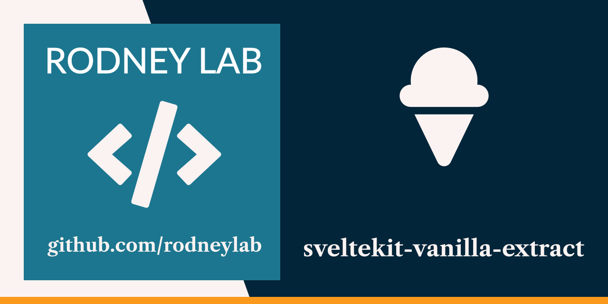

<p align="center">
  <a aria-label="Open Rodney Lab site" href="https://rodneylab.com" rel="nofollow noopener noreferrer">
    
  </a>
</p>
<h1 align="center">
  SvelteKit vanilla-extract
</h1>

# sveltekit-vanilla-extract

[](https://open.vscode.dev/rodneylab/sveltekit-vanilla-extract)

Demo code for getting started with vanilla-extract in SvelteKit. The code accompanies the <a aria-label="Open Rodney Lab blog post on using vanilla extract with Svelte Kit" href="https://rodneylab.com/using-vanilla-extract-sveltekit/">post on using vanilla-extract with SvelteKit</a>. If you have any questions, please drop a comment at the bottom of that page.

## Building and previewing the site

If you're seeing this, you've probably already done this step. Congrats!

```bash
git clone https://github.com/rodneylab/sveltekit-infinite-scroll.git
cd sveltekit-infinite-scroll
pnpm install # or npm install
pnpm run dev
```

## Building

```bash
pnpm run build
```

> You can preview the built app with `pnpm run preview`, regardless of whether you installed an adapter. This should _not_ be used to serve your app in production.
